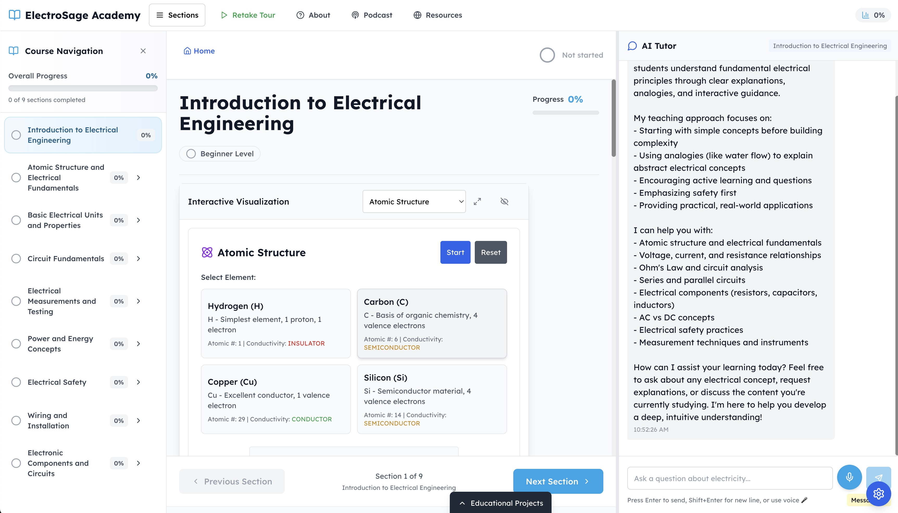

# ElectroSage Academy

A comprehensive electrical education platform featuring AI-powered Socratic tutoring, 14 interactive visualizations, educational podcasts, voice-to-text learning, and professional circuit building tools. Master electrical engineering from fundamentals to advanced concepts.

**🚀 Live Demo**: [Visit ElectroSage Academy](https://github.com/EmminiX/ElectroSage)



*ElectroSage Academy's comprehensive learning interface featuring AI-powered Socratic tutoring, interactive content navigation, and real-time progress tracking.*

## Features

### 🎓 Comprehensive Electrical Education
- **8 Progressive Sections**: From atomic structure to advanced electronic components
- **Professional Curriculum**: Structured learning path with mastery tracking
- **Interactive Content**: Rich educational content with embedded visualizations
- **Real-world Applications**: Practical knowledge for electrical engineering

### 🤖 AI-Powered Socratic Tutoring
- **ElectroSage AI**: Advanced AI tutor using Socratic questioning method
- **Personalized Learning**: Context-aware responses tailored to your progress
- **Guided Discovery**: Never gives direct answers - helps you discover solutions
- **Conversation History**: Maintains context across learning sessions
- **Voice-to-Text**: Powered by OpenAI Whisper for natural speech input

### 🔧 14 Interactive Visualizations
- **Circuit Builder**: Professional circuit construction with component library
- **Atomic Structure**: Interactive atomic models showing conductivity properties
- **AC Waveform Analysis**: Real-time frequency analysis and RMS calculations
- **Series/Parallel Circuits**: Current division and voltage drop demonstrations
- **Transformer Operation**: Interactive transformer voltage transformation
- **Capacitor/Inductor Effects**: Charging curves and magnetic field visualization
- **Safety Demonstrations**: Interactive electrical safety scenarios
- **Resistance Effects**: Heat generation and material property visualization

### 🎧 Educational Podcasts
- **8 Section-Based Episodes**: Professional podcast series covering each course section
- **Expert Insights**: In-depth discussions and real-world applications
- **iPhone Dynamic Island Player**: Minimalist audio player with track controls
- **Integrated Learning**: Podcasts complement visualizations and written content

### 🎤 Voice-to-Text Learning
- **OpenAI Whisper Integration**: High-accuracy speech-to-text transcription
- **Natural Voice Input**: Speak questions directly to the AI tutor
- **HTTPS Security**: Secure microphone access with permission management
- **Real-time Processing**: Live audio level feedback and instant transcription

### ♿ Accessibility Features
- **Keyboard Navigation**: Full keyboard support for all interactions
- **High Contrast Mode**: Enhanced visibility for users with visual impairments
- **Reduced Motion**: Respects user preferences for motion sensitivity
- **Focus Management**: Clear focus indicators and logical tab order
- **Screen Reader Support**: ARIA labels and semantic HTML
- **Voice Input**: Speech-to-text for hands-free interaction

## Getting Started

### Prerequisites
- Node.js 18+ 
- npm or yarn
- OpenAI API key

### Installation

1. **Clone the repository**
   ```bash
   git clone https://github.com/EmminiX/ElectroSage.git
   cd ElectroSage
   ```

2. **Install dependencies**
   ```bash
   npm install
   ```

3. **Set up environment variables**
   ```bash
   cp .env.example .env.local
   ```
   
   Edit `.env.local` and add your OpenAI API key:
   ```
   OPENAI_API_KEY=your_openai_api_key_here
   ```

4. **Run the development server**
   ```bash
   npm run dev
   ```

5. **Open your browser**
   Navigate to [http://localhost:4100](http://localhost:4100)

## Deployment

### 🐳 Docker Deployment (Recommended)

The easiest way to deploy ElectroSage Academy is using Docker Compose:

1. **Prerequisites**
   - Docker and Docker Compose installed
   - OpenAI API key

2. **Environment Setup**
   ```bash
   # Copy the environment template
   cp .env.example .env.local
   
   # Edit .env.local with your OpenAI API key
   nano .env.local
   ```

3. **Deploy with Docker Compose**
   ```bash
   # Build and start the application
   docker compose build
   docker compose up -d
   
   # View logs (optional)
   docker compose logs -f
   ```

4. **Access the Application**
   - Open your browser to [http://localhost:4100](http://localhost:4100)
   - The application will be running in production mode with optimized performance

5. **Management Commands**
   ```bash
   # Stop the application
   docker compose down
   
   # Rebuild after code changes
   docker compose build --no-cache
   docker compose up -d
   
   # View application status
   docker compose ps
   ```

### Traditional Production Build
```bash
npm run build
npm start
```

### Environment Variables for Production
- `OPENAI_API_KEY`: Your OpenAI API key (**required**)
- `OPENAI_MODEL`: AI model to use (default: gpt-4)
- `OPENAI_MAX_TOKENS`: Maximum tokens per response (default: 1000)
- `OPENAI_TEMPERATURE`: AI response creativity (default: 0.7)
- `NEXT_PUBLIC_APP_NAME`: Application name
- `NEXT_PUBLIC_APP_VERSION`: Application version
- `NODE_ENV`: Set to "production" for optimized builds
- `PORT`: Application port (default: 4100)

### Deployment Platforms
This app can be deployed on:
- **Docker Compose** (recommended - see above)
- **Vercel** (excellent for Next.js)
- **Netlify**
- **AWS Amplify**
- **Digital Ocean App Platform**
- **Heroku**
- **Any VPS with Docker support**

## Usage Guide

### Navigation
- Use the sidebar to navigate between sections
- Progress is automatically tracked
- Settings panel (⚙️) for accessibility options

### ElectroSage AI Tutor
- Click the chat icon to open the AI tutor
- Experience Socratic method teaching - no direct answers!
- Get guided discovery through electrical concepts
- Ask questions about any section for personalized help
- Use voice input by clicking the microphone button (requires HTTPS or localhost)
- Speak naturally - Whisper AI converts speech to text

### Interactive Visualizations
- 14 advanced visualizations available across all sections
- Circuit Builder: Professional drag-and-drop circuit construction
- Atomic Structure: Explore elements and their conductivity properties
- AC Waveform: Real-time frequency analysis and oscilloscope simulation
- Transformer Demo: Interactive voltage transformation visualization
- Safety Scenarios: Interactive electrical safety training

### Educational Podcasts
- 8 professional podcast episodes, one for each course section
- Access via the iPhone Dynamic Island-style player in the top navigation
- Auto-minimize functionality with smooth playback transitions
- Full track controls with next/previous and episode selection dropdown

### Accessibility
- Press `Ctrl/Cmd + A` to open accessibility panel
- Use Tab/Shift+Tab for keyboard navigation
- Enable high contrast or reduced motion as needed
- Voice input available for hands-free interaction
- Full screen reader support with ARIA labels

## Technical Architecture

### Frontend Stack
- **Next.js 15**: React framework with App Router for optimal performance
- **TypeScript**: Type-safe development with full IntelliSense support
- **Tailwind CSS**: Utility-first CSS framework for responsive design
- **React Context**: Global state management for learning progress and accessibility
- **Framer Motion**: Smooth animations and transitions

### Interactive Visualizations
- **D3.js**: Advanced data visualization library for educational charts
- **Three.js**: 3D graphics engine for atomic structure visualization
- **Canvas API**: Professional circuit builder with drag-and-drop interface
- **Web Audio API**: Real-time audio processing for AC waveform analysis

### Backend & AI
- **Next.js API Routes**: Server-side functionality and API endpoints
- **OpenAI GPT-4**: Advanced AI tutoring with Socratic method implementation
- **OpenAI Whisper**: High-accuracy speech-to-text transcription
- **Markdown Processing**: Rich content rendering with mathematical expression support
- **Remark/Rehype**: Extensible markdown processing pipeline

### DevOps & Deployment
- **Docker**: Containerized deployment with multi-stage builds
- **Docker Compose**: Orchestration for easy local and production deployment
- **ESLint & TypeScript**: Code quality and type checking
- **Next.js Optimization**: Automatic code splitting and performance optimization

### Key Components
- `ContentContext`: Manages learning content and navigation
- `ProgressContext`: Tracks user progress and achievements
- `AccessibilityContext`: Handles accessibility preferences
- `PodcastContext`: Manages podcast player state and episodes
- `TourContext`: Handles interactive onboarding tour system
- `ChatInterface`: AI tutor integration with voice input
- `SpeechRecorder`: Voice-to-text component using OpenAI Whisper
- `PodcastPlayer`: iPhone Dynamic Island-style audio player
- `VisualizationContainer`: Interactive learning tools

## Development

### Project Structure
```
src/
├── app/                 # Next.js App Router pages
├── components/          # React components
├── contexts/           # React Context providers
├── data/              # Static data and types
├── hooks/             # Custom React hooks
├── lib/               # Utility functions
└── styles/            # Global styles
```

### Scripts
- `npm run dev`: Start development server
- `npm run build`: Create production build
- `npm run start`: Start production server
- `npm run lint`: Run ESLint

### Performance Features
- **Next.js 15 Optimizations**: Automatic code splitting and tree shaking
- **Image Optimization**: Responsive images with WebP format
- **Static Generation**: Pre-rendered pages for faster loading
- **Edge Runtime**: Optimized API routes with global deployment
- **Progressive Web App**: Offline support and mobile app-like experience

## Troubleshooting

### Common Issues

**1. OpenAI API Key Issues**
```bash
# Verify your API key is set correctly
echo $OPENAI_API_KEY

# Check if the key has the correct permissions
# Ensure your OpenAI account has sufficient credits
```

**2. Docker Build Fails**
```bash
# Clear Docker cache and rebuild
docker system prune -f
docker compose build --no-cache
```

**3. Port Already in Use**
```bash
# Change the port in docker-compose.yml or .env.local
# Default port is 4100, you can use any available port
```

**4. Voice Input Not Working**
- Ensure you're using HTTPS or localhost
- Check browser microphone permissions
- Verify Web Audio API support in your browser

**5. Visualizations Not Loading**
- Clear browser cache and cookies
- Ensure JavaScript is enabled
- Check browser console for any errors

### Browser Compatibility
- **Chrome**: Fully supported (recommended)
- **Firefox**: Fully supported
- **Safari**: Fully supported
- **Edge**: Fully supported
- **Mobile**: Responsive design works on all mobile browsers

## Contributing

1. Fork the repository
2. Create a feature branch
3. Make your changes
4. Add tests if applicable
5. Submit a pull request

## Educational Content

### Learning Sections
1. **Introduction to Electrical Engineering** - Foundational concepts and career overview
2. **Atomic Structure and Electrical Fundamentals** - How matter enables electrical flow
3. **Understanding the Atom** - Detailed atomic behavior and electrical properties
4. **Electron Shells and Valence Electrons** - Electronic structure and conductivity
5. **Electrical Charge and Charge Interaction** - Fundamental forces and field theory
6. **Coulomb's Law and Charge Quantification** - Mathematical foundations of electrostatics
7. **Basic Electrical Units and Properties** - Standard units and measurement principles
8. **Circuit Fundamentals** - Practical circuit analysis and component behavior

### Assessment & Progress
- **Interactive Quizzes**: Knowledge verification for each section
- **Progress Tracking**: Visual progress indicators and completion statistics
- **Mastery-Based Learning**: Must demonstrate understanding before advancing
- **Socratic AI Feedback**: Personalized guidance without giving direct answers

## Contributing

We welcome contributions to ElectroSage Academy! Here's how you can help:

### Development Setup
1. Fork the repository
2. Create a feature branch (`git checkout -b feature/amazing-feature`)
3. Make your changes
4. Add tests if applicable
5. Ensure all tests pass (`npm run lint`)
6. Commit your changes (`git commit -m 'Add amazing feature'`)
7. Push to the branch (`git push origin feature/amazing-feature`)
8. Open a Pull Request

### Areas for Contribution
- **Educational Content**: Additional sections, improved explanations
- **Visualizations**: New interactive demonstrations and simulations
- **Accessibility**: Enhanced screen reader support and keyboard navigation
- **Internationalization**: Multi-language support
- **Performance**: Optimization and speed improvements
- **Testing**: Unit tests and integration tests

## License

This project is licensed under the ISC License. See the LICENSE file for details.

## Acknowledgments

- **OpenAI**: For providing the GPT-4 and Whisper APIs that power our AI tutoring
- **Next.js Team**: For the excellent React framework and development experience
- **Educational Community**: For feedback and suggestions that improve the learning experience

## Support

- **Issues**: Report bugs or request features via [GitHub Issues](https://github.com/EmminiX/ElectroSage/issues)
- **Discussions**: Join community discussions in [GitHub Discussions](https://github.com/EmminiX/ElectroSage/discussions)
- **Documentation**: Find additional help in our [Wiki](https://github.com/EmminiX/ElectroSage/wiki)

---

**Made with ❤️ for electrical engineering education**
